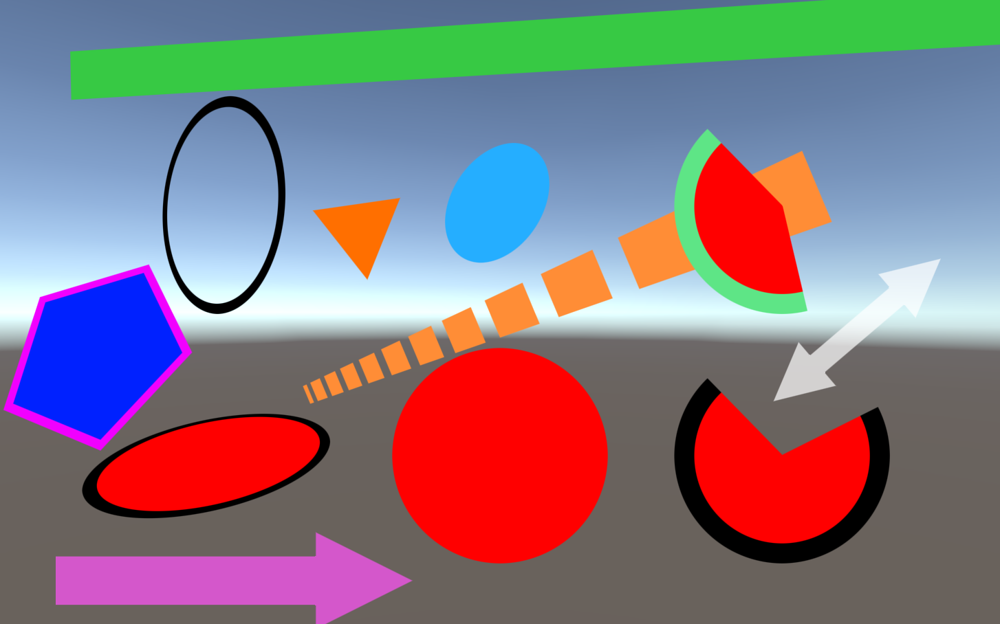

WIP : Forked from Miguel Ferreira 

# UnityShapes
Draw anti-aliased, GPU-instance-supported, 0 allocation shapes (circle,line,arrow) with one line of code in Unity



# Installation 

### Via git

Edit the `manifest.json` file located in the `Packages` folder of your unity project and
add the follwing line to the list of `dependencies`:
```json
"com.nukadelic.unityshapes": "https://github.com/nukadelic/UnityShapes.git"
```

Couldn't´t be simpler:

```c#
Circle.Draw(new CircleInfo{
				center = transform.position,
				forward = transform.forward,
				radius = 1f,
				fillColor = Color.Red
			});
```


Lots of customization options


```c#
public struct CircleInfo
{
  public float radius;
  public Vector3 center;
  public Vector3 forward;

  public Color fillColor;

  public bool bordered;
  public Color borderColor;
  public float borderWidth;

  public bool isSector;
  public float sectorInitialAngleInDegrees;
  public float sectorArcLengthInDegrees;
}
```


```c#
public struct LineInfo
{
  public Vector3 startPos;
  public Vector3 endPos;
  public Color fillColor;
  public Vector3 forward;
  public float width;

  public bool bordered;
  public Color borderColor;
  public float borderWidth;

  public bool dashed;
  public float distanceBetweenDashes;
  public float dashLength;

  public bool startArrow;
  public bool endArrow;

  public float arrowWidth;
  public float arrowLength;
}
```


```c#
 public struct PolygonInfo
 {
     public int sides;
     public Vector3 center;
     public float size;

     public Color color;

     public bool bordered;
     public float borderWidth;
     public Color borderColor;

     public Quaternion rotation;
 }
```


Tested on standalone and WebGL, but should work on mobile as well.